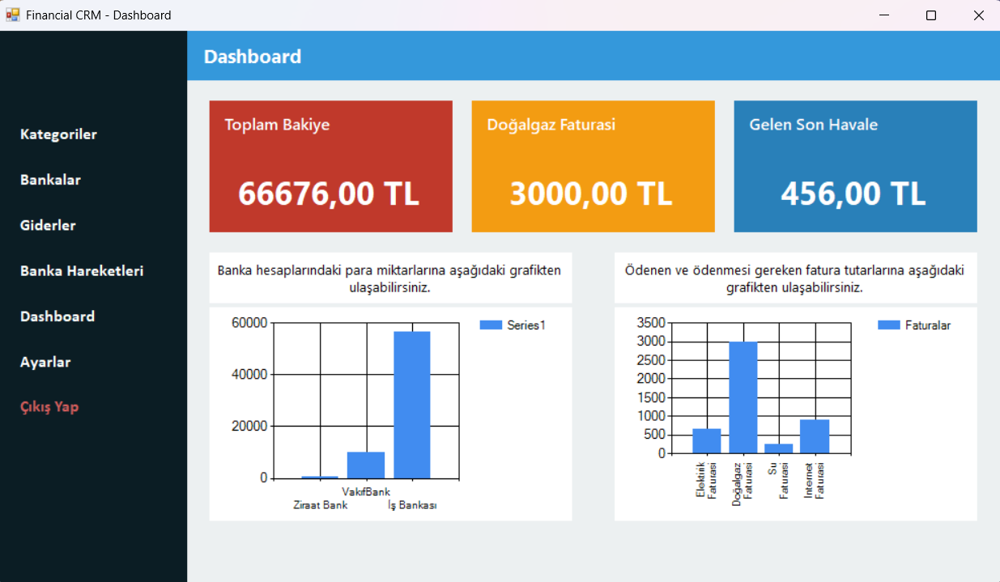
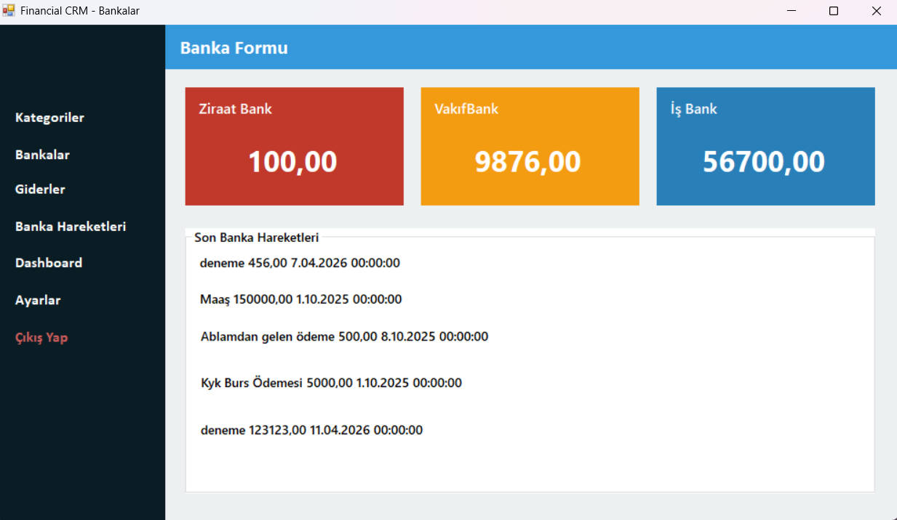
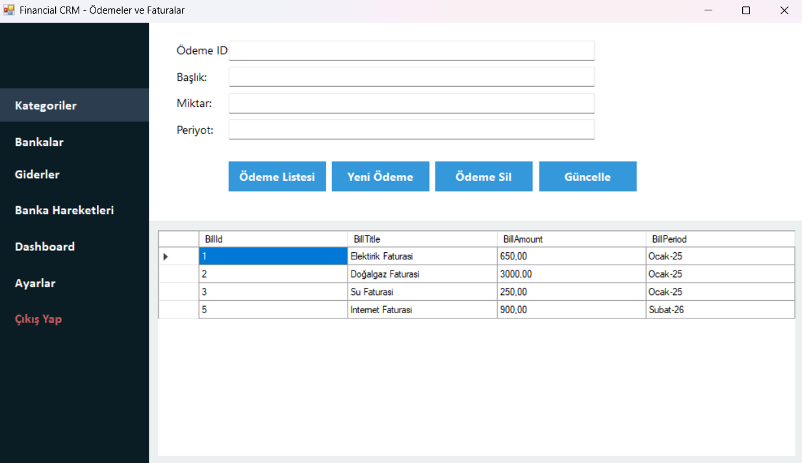
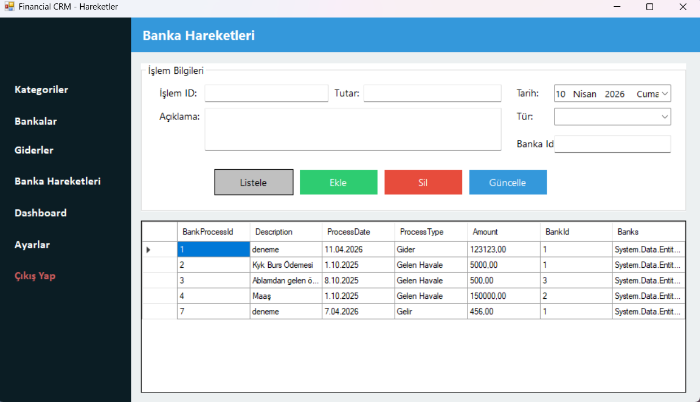
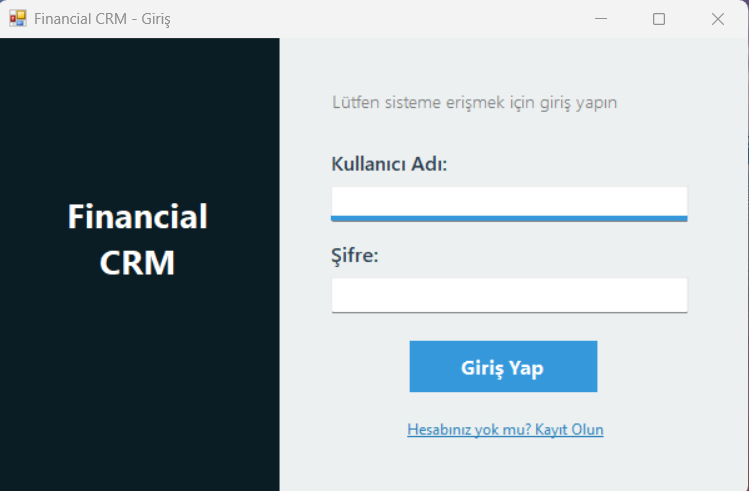
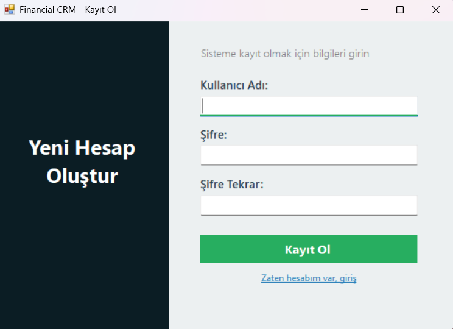

# Financial CRM 📊

Bu proje, Murat Yücedağ ve ekibinin hazırladığı C# eğitim serisi takip edilerek geliştirilmiştir.

C# ve Windows Forms kullanılarak geliştirilen bu Finansal Müşteri İlişkileri Yönetimi (CRM) masaüstü uygulaması; kullanıcıların banka hesaplarını, faturalarını, harcamalarını ve banka işlemlerini tek bir merkezden kolayca takip edebilmesini amaçlar.

## 🚀 Özellikler

- **Kullanıcı Kimlik Doğrulaması:** Güvenli kullanıcı girişi ve yeni üye kayıt işlemleri.
- **Dashboard (Kontrol Paneli):** Finansal durumun genel özetini, toplam bakiyeyi ve son harcamaları grafiksel verilerle gösteren ana ekran.
- **Banka Yönetimi:** Farklı bankalardaki hesapların ve güncel bakiyelerin takibi.
- **Fatura İşlemleri:** Ödenecek veya ödenmiş faturaların (Elektrik, Su, Doğalgaz vb.) sisteme eklenmesi, güncellenmesi ve takibi.
- **Banka Hareketleri:** Gelen/giden havale, EFT ve diğer tüm banka işlemlerinin detaylı olarak listelenmesi.
- **Veritabanı Entegrasyonu:** Entity Framework kullanılarak verilerin güvenli ve ilişkisel bir şekilde saklanması.

## 🛠️ Kullanılan Teknolojiler

* **Dil:** C#
* **Arayüz:** Windows Forms (.NET Framework)
* **ORM:** Entity Framework (Database First)
* **Veritabanı:** Microsoft SQL Server
---

## 📸 Ekran Görüntüleri

### Dashboard Paneli

### Bankalar ve Hesap Durumu

### Fatura ve Ödeme Takibi

### Banka İşlemleri

### Giriş Ekranı

### Kayıt Ekranı

---

